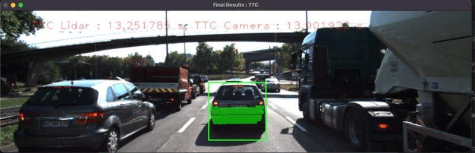
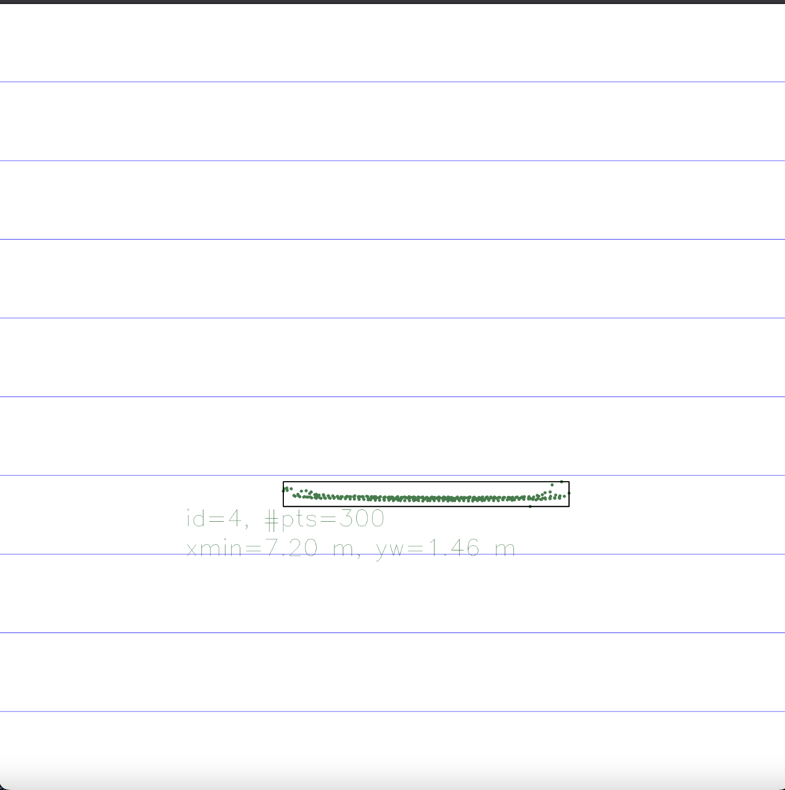
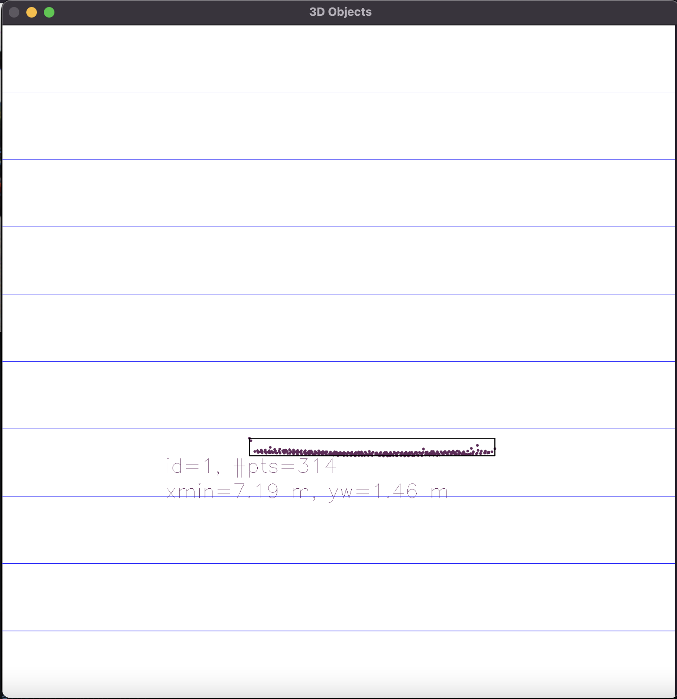
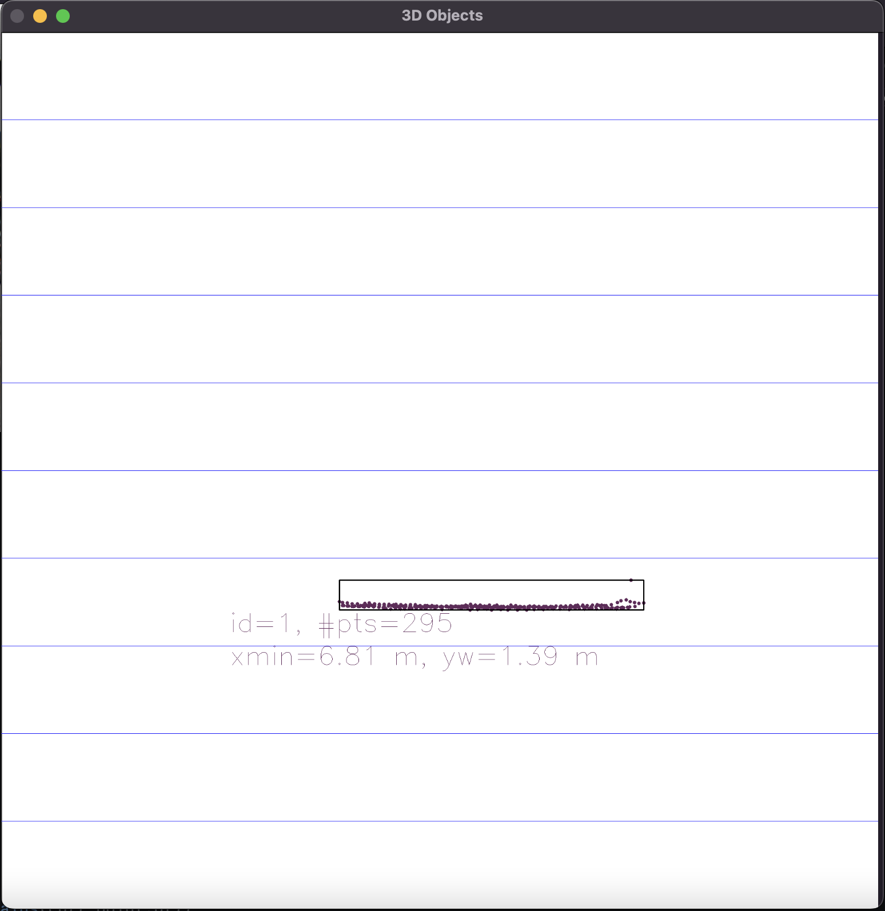
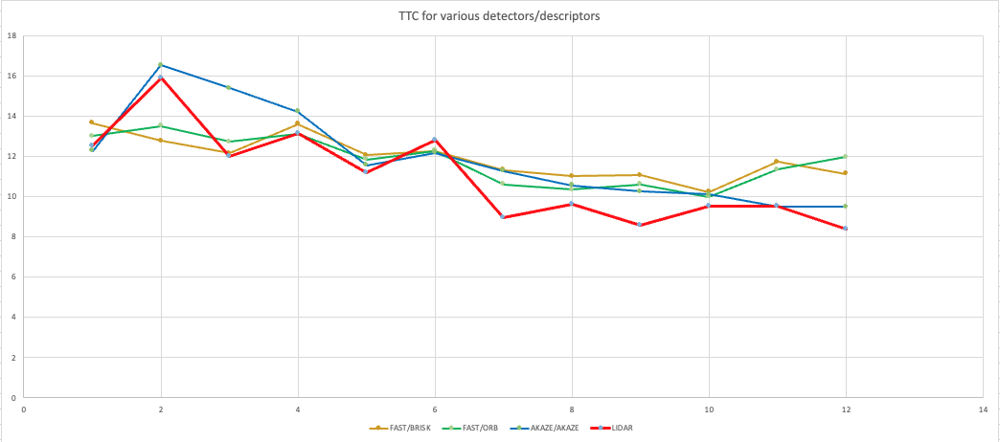

# SFND 3D Object Tracking

In this final project, I implemented the missing parts in the schematic by completing four major tasks: 
1. First, I developed a way to match 3D objects over time by using keypoint correspondences. 
2. Second, I computed the TTC based on Lidar measurements. 
3. I computed TTC using the camera by matching keypoints in the regions of interest. 
4. I conducted various tests to identify the most suitable detector/descriptor combination for TTC estimation and also to search for problems that can lead to faulty measurements by the camera or Lidar sensor. 

The results of the implementation is shown in below pictures.

## Dependencies for Running Locally
* cmake >= 2.8
  * All OSes: [click here for installation instructions](https://cmake.org/install/)
* make >= 4.1 (Linux, Mac), 3.81 (Windows)
  * Linux: make is installed by default on most Linux distros
  * Mac: [install Xcode command line tools to get make](https://developer.apple.com/xcode/features/)
  * Windows: [Click here for installation instructions](http://gnuwin32.sourceforge.net/packages/make.htm)
* Git LFS
  * Weight files are handled using [LFS](https://git-lfs.github.com/)
  * Install Git LFS before cloning this Repo.
* OpenCV >= 4.1
  * This must be compiled from source using the `-D OPENCV_ENABLE_NONFREE=ON` cmake flag for testing the SIFT and SURF detectors.
  * The OpenCV 4.1.0 source code can be found [here](https://github.com/opencv/opencv/tree/4.1.0)
* gcc/g++ >= 5.4
  * Linux: gcc / g++ is installed by default on most Linux distros
  * Mac: same deal as make - [install Xcode command line tools](https://developer.apple.com/xcode/features/)
  * Windows: recommend using [MinGW](http://www.mingw.org/)

## Basic Build Instructions

1. Clone this repo.
2. Get large files with git lfs : `git lfs pull`
3. Make a build directory in the top level project directory: `mkdir build && cd build`
4. Compile: `cmake .. && make`
5. Run it: `./3D_object_tracking`.

## Writeup

### FP1. Match 3D Objects

I implemented bounding box match between the current frame and the previous frame.
The implementation iterate through keypoint matches between the two frames.
In each match, it associates the keypoints in the match to the bounding box of each frame.
If it associated successfully, then it count up match counts for index pair of bounding boxes.
Finally, it returns the highest match.

Please refer `matchBoundingBoxes()` in `camFusion_Student.cpp` for the details.

### FP2. Compute Lidar-based TTC

I implementated a lidar based TTC computation based on the constant-velocity model.
First, the algorithm sort the distance of each points in ascending order for each box. 
I reduced outlier influence by measuring TTC with using median distance not the closest one.

Please refer `computeTTCLidar()` in `camFusion_Student.cpp` for the details.

### FP3. Associate Keypoint Correspondences with Bounding Boxes

I associated keypoint correspondences with bounding box by location.
First, it get candidates which is resided in the bounding box from the whole match.
Then, it calculates the mean and the standard variance(sigma) of distance the points from each match.
I removed points which not in the 2 sigma from the mean to reduce outlier influence.

Please refer `clusterKptMatchesWithROI()` in `camFusion_Student.cpp` for the details.

### FP4. Compute Camera-based TTC

I implementated a camera based TTC computation with keypoint correspondences based on the constant-velocity model.
It can compute TTC by comparing distance ratio of each keypoints in successive frames.
I reduced outlier influence by measuring TTC with using median distance not the closest one.

Please refer `computeTTCCamera()` in `camFusion_Student.cpp` for the details.

### FP5. Performance Evaluation 1

I looked each lidar frame in the dataset and selected few frames where TTC estimate is not plasible.

|Frame #1 | Frame #2 | Frame #3|
| --- | --- | --- |
|  | | |

In Frame #1, we can see the outlier towards the ego vehicle direction, if we choose the closest point to measure TTC in this case, TTC will be off from the ground truth.

In Frame #2 and #3, we can see the outlier in the edge of the target object, if we choose to use the mean value to compute TTC in this case, TTC calculation will be off from the ground truth.

### FP6. Performance Evaluation 2

I changed the `FinalProject_Camera.cpp` to change detector / descriptor pairs in command line.
Then, I get result of all detector / descriptor pairs to evaluate performance.
The code for testing all combinations is in `evaluate.py` and the result is in `result.xlsx`.

I compared each pair of detector / descriptor to the Lidar TTC result.
I observed some not available values(i.e. nan, -inf) for HARRIS and ORB detector therefore it is not appropriate for TTC measurement.
Then, I choosed top three combinations for camera TTC computation based on sum of absolute error and average error from Lidar TTC result.

The top 3 are:

| Detector/Descriptor | Sum of absolute error(s) | Mean of error(s) |
| --- | --- | --- |
| AKAZE/AKAZE | 13.01 | 1.08 |
| FAST/BRISK | 15.12 | 1.26 |
| FAST/ORB | 18.20 | 1.52 |

